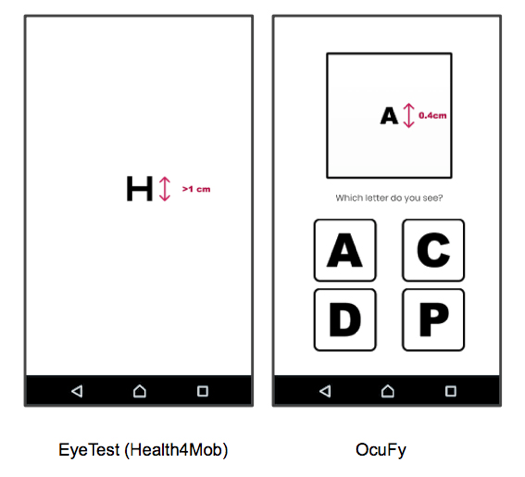
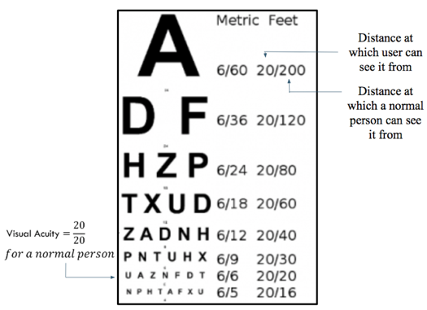
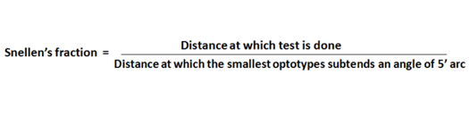
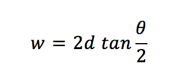
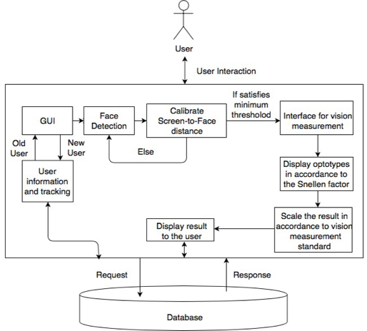
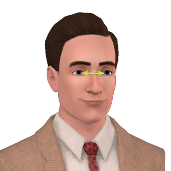
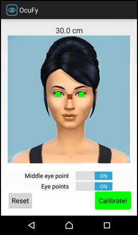
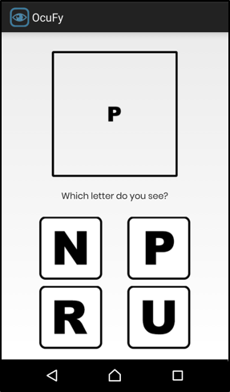
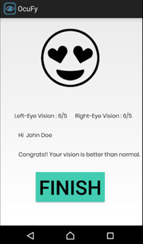

Ocufy - a mobile eye testing interface with which any user can check their eye acuity in just under five minutes!

Check out the webpage for the project on : www.ocufy.xyz

# Abstract
Eye-testing is one of the most important health check-up required by all individuals. However, it turns out that it is also one of the most neglected check-ups of all time. Most people do not anticipate the need for checking their eyes until their vision is affected. Due to these reasons, we created Ocufy - a mobile eye testing interface with which any user can check their eye acuity in just under five minutes. Not only is it free to use for everyone, but it also provides one of the most accurate results of a mobile eye test. This accuracy is achieved with the help of an algorithm which finds the user’s screen-to-face distance and starts the test only after a minimum threshold is achieved thus providing the most authentic results. We performed the evaluation with 10 people and found out that the application provided accurate results 85% of the time. Moreover, the application received an average rating of 4.5/5 with over 80% respondents recommending it to use it next time to check their eyes.

# Intorduction
Today, with advances in technology, the human eye is getting more and more hitched to the digital screen making it prone to blurred vision. A study published in the journal Ophthalmology found that on current trends, 50 percent of people on the planet would need glasses or contact lenses with 10 percent suffering from severe myopia. Our application relieves the pain of the user who has no access to an eye clinic. Also, it is for the user who does not anticipate the need for checking their eye until their vision is affected.

# Motivation
With each author diagnosed with myopia, one of the major motivation for this research project was to make people realize the importance of an eye test before there is a need for it. It is recommended for each person to get an eye test at least every two years. In one of the research study conducted, 80% of respondents believed that sight is the most important sense, however, a third hadn’t gotten an eye test in four years or more, with a worrying 6% have never had an eye exam. 

According to WHO, an estimated 253 million people live with vision impairment where 36 million are blind and 217 million have moderate to severe vision impairment. 81% of people who are blind or have moderate or severe vision impairment are aged 50 years and above. The other affected people are especially children and people from low and middle-income countries. Lastly, women are most affected by this as at least 2/3rd of blind people are women. But the most important factor for motivation was that 80 percent of all vision impairment can be prevented or cured.

# Problems in Existing Systems
The systems discussed in the previous section has various limitations that make the vision testing and screening extremely difficult for the user. The reasons are:

## 1) Too Expensive for the average user

Most of the professional and accurate eye testing solutions are developed for oculists who can afford to buy these expensive software for their clinics. The average user cannot purchase these software as they are too expensive and are complicated to set up initially without the help of an expert user. For instance, the Canela 20/20 Vision offers their software for $49 or $69 monthly pricing plans while the Precision vision software is priced as high as $1125.

## 2)	Incorrect Results provided by most solutions:

To overcome the issue of expensive software and due to the increased availability of smartphones, many software developers hopped on the idea of making an eye testing application for smartphones. While this is a novel idea with which user can easily check their eye vision instantly, it seldom provides any accurate results. The main reason being that the same test is provided for every screen size and every person irrespective of the distance at which they are holding their phones.

  

# Method

To make the eye test mobile, we first need to understand how the traditional eye testing system works. We also need to understand how the results are evaluated for this test. Moreover, it has to be learned how can this method be converted so as to be viable to implement in a small phone screen.

## 1) Understanding the Snellen Chart
A Snellen chart is an eye chart that can be used to measure visual acuity. Snellen charts are named after the Dutch ophthalmologist Herman Snellen, who developed the chart in 1862. The normal Snellen chart is printed with eleven lines of block letters. The first line consists of one very large letter, which may be one of several letters, for example, E, H, or N. Subsequent rows have increasing numbers of letters that decrease in size. A person taking the test covers one eye from 6 meters or 20 feet away, and reads aloud the letters of each row, beginning at the top. The smallest row that can be read accurately indicates the visual acuity in that specific eye. The symbols on an acuity chart are formally known as "optotypes"

  

## 2) Optotypes and their Characteristics
In the case of the traditional Snellen chart, the optotypes have the appearance of block letters and are intended to be seen and read as letters. They are not, however, letters from any ordinary typographer's font. They have a particular, simple geometry with some unique characteristics. The following are the features of the optotypes:
•	Snellen developed optotypes using symbols based in a 5×5-unit grid so that the size of the critical detail (each gap width) subtends 1/5th of the overall height
•	The thickness of the lines equals the thickness of the white spaces between line
•	The height and width of the optotype (letter) is five times the thickness of the line.

  

## 3) Constructing Visual Acuity Chart

Before constructing a Visual Acuity Chart, one needs to know and decide what kind of chart one wants to construct. There are actually different kinds of charts for visual acuity measurement with Snellen chart being the most common. Based on construction they generally fall into two categories, Snellen and logMAR [11]. Visual Acuity Chart can be constructed based on 2 criteria: 

1.	Measurement of minimum separable acuity
2.	Measurement of minimum recognizable acuity

Two distinct points can only be recognized as separate when they subtend an angle of one minute arc at nodal point of eye.

## 4) Defining Standard Vision
Snellen defined “standard vision” as the ability to recognize one of the optotypes when it subtends an angle of 5 minutes of arc. It is a representation of visual acuity in the form of a fraction (e.g. 6/6, 20/20) in which the numerator is the testing distance, and the denominator is the distance at which smallest Snellen letter read by the eye has an angular size of 5 minutes.

  

For example, 6/60 means the ability to see an object only at 6 meters which should be normally seen at 60 meters. At 6-meter (20 ft.), the letters on the 6/60 (or 20/20) line should subtend 5 minutes of arc (each limb of the letters subtend 1 minute of arc)

## 5) Finding the Height and Width of Optotypes for Mobiles

Finally, the knowledge of all this information can be used to find the dimensions of the optotypes for conducting an eye test in mobile. Only if we strictly follow these dimensions, can we get an accurate eye result. We know that at exactly 6 meters distance from the patient, the letters on the 6/6 line shall subtend 5 minutes of arc (such that the individual limbs of the letters subtend 1 minute of arc), which means that the chart should be sized such that these letters are 8.73 mm tall and the topmost (6/60) "E" should be 87.3 mm tall. We get the formula

  

where w is the optotype height or width (which are the same due to the optotype being on a square grid), d is the distance from eye to chart, and θ is the angle subtended by the optotype (which is 5 arcminutes as specified by Snellen).

These calculations result into finding a scaling factor by which we can decide the size of the topmost optotype for a mobile eye test. It is found that the eye should be at a distance 68.76 times the height of the top (6/60) letter. This is how human computer interaction methodologies and its understanding can be used to make these optotypes suitable for the phone’s screen.

# Implementation
The first phase of designing the system is to select an architecture. The diagram shows the architecture of the proposed system, where a 2-tier client-server architecture is selected. The main reason for selecting the said framework is that we can store the information of the user who wants to test their eyes. This will help us keep a record of the users while also being able to track users history of eye check-ups. Lastly, by getting the users information, we can create a unique test based on the user's age, gender, location etc. Hence a database is used to store the information of the user’s details and his/her eye test results. 

  

 The architecture of the system is thus divided into two layers, namely, the client side layer and the server side layer. At the client side, the user interacts with the system using the Graphical User Interface (GUI) where the user first has to enter his/her information i.e. the name, age, and gender. Then, the face detection module starts where the user has to calibrate and find the distance between the face and the screen. Once this distance is found and the minimum distance threshold is maintained, the user can proceed to give the test. This test involves the user to close one eye and answer all the questions. This same is repeated for the other eye.

## 1) Face Detection and Caliberation 
This module is one of the most important part of the application. This helps in finding the distance between the phone and the screen of the user. The face detection can be done with the help of pre-built Android Face Detection libraries. In turn, this distance parameter helps to build the most accurate eye testing application. The detected face can provide us the results of the distance between the eyes. 

  
  

## 2) Eye Test
The test is conducted in the manner that the optotypes on basis of a Snellen factor are shown to the user. These optotypes keep decreasing in size. This decrease in size is also kept uniform to get the most accurate result. After looking at the optotype, the user has an option to select which symbol he/she just saw on the screen. The user can select from one of the four options provided. The options are also given in such a way that the user cannot simply guess on the basis of the shape of the optotype shown. For example, when the optotype “C” is shown, the options are kept in a way that user cannot guess the answer on the basis of the shape of C. So the options are shown along with “C” are generally “G”, “O”, “D” etc.

  
  

# Evaluation
In order to find the accuracy of the developed system, we conducted a user study where each user was given our system and another android application “EyeTest” available in the play store. The results of both these tests were recorded and also the original eye score of the user was recorded if the user had already conducted an eye test with a doctor before.
The goal of the user study was to find out if the results provided by the application is accurate to the actual vision of the respondent. 0 respondents of the age group 20-35 participated in the study. There were total 8 boys and 2 girls in the survey. Also, a total of 3 people already had spectacles while one of the respondent had performed a LASIK surgery to remove the spectacles.

A lot of interesting findings were found in this user study. Five respondents were able to check their eyes and confirm that their vision is normal as described by the other application as well. Also, three of the respondents who had spectacles were able to find an almost accurate representation of their vision score proving that the results were genuine. To validate this claim, their spectacle tests also claimed proper vision score. There were 2 very interesting findings. First, a respondent who had conducted LASIK surgery (to remove lens) [14] found to have a 0.5 power score in one of the eyes. The same was found in both the applications along with the confirmation of low vision score in Both Eyes test (6/9, 50%). Hence, the respondent was advised to visit a doctor immediately. In another finding, one user who did not have spectacles initially was found to have a vision score of (6/9, 69%) in all the tests performed in both the applications. This was conclusive evidence that the respondent immediately required a doctor’s visit. 

# Conclusion
We proposed, designed and implanted a mobile eye-testing interface called Ocufy which would let the users check their eye vision with a mobile phone application. We designed the algorithm for finding accurate eye vision results by first researching the basics of finding eye vision score and about the Snellen chart and its optotypes. HCI methodologies helped us understand the importance of correct and accurate representation of optotypes for genuine eye test result where a scaling factor was devised for showing eye tests on mobile phones. It was found that the phone-to-face distance must be 68.76 times the topmost optotype. This distance factor was calculated and implemented by facial and eye tracking of the user. Finally, a test was shown to the user if the user was a certain minimum threshold distance away from the phone. The answers to these tests were then scaled back to the original Snellen chart results which stand as a standard form of eye vision calculations. The application provided an 85% Accuracy of correct result prediction (Ocufy Individual Eye Test w.r.t. the Original Eye Vision) with an over 80% applicants recommending it using again to get an initial screening of their vision.

# Future Scope
It is rightly said that ‘What do you do after you achieve one goal? You look for another one’. During the implementation of this system, it is found that there are instances and scopes where the system could be improved. Following was the observations:
1) The face-to-phone distance measurement module can be kept completely running throughout the test which can pause the test if the user brings the phone nearby.
2) The face detection module can be further calibrated to monitor the inclination angle of the phone. This can make sure that the user is holding the phone at a correct angle to provide much more accurate results.
3) Provide relevant doctor suggestions in the nearby locality (using maps API) if the user requires to immediately check up with an ophthalmologist.
4) Increase the functionality of the application by providing tests to check color blindness, astigmatism, contrast/sensitivity, cataract detection, duo-chrome acuity etc.

### Please Check the Technical Paper attached to find the list of References.
